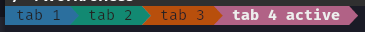

## Install

1. Copy `tab_bar.py` into your kitty config directory (usually `~/.config/kitty/`).
2. Add to `kitty.conf`:

```conf
tab_bar_style custom
```

3. Reload kitty (`Ctrl+Shift+F5`) or restart it.

On reload, tab colors are reassigned randomly.

Requires a Nerd Font (or another font with Powerline glyphs) for the tab separators.
